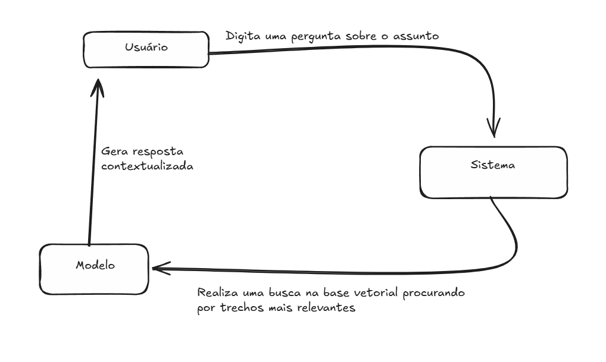
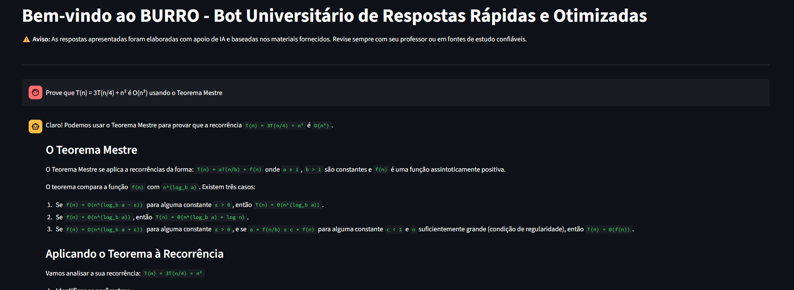

# 1. Identificação do Projeto

**Título da Solução:**  
BURRO - Bot Universitário de Respostas Rápidas e Otimizadas  

**Nome do(a) Autor(a):**  
Gabriel da Silva Pereira  

---

# 2. Contextualização e Justificativa

**Qual problema educacional a solução pretende resolver?**  
Muitos estudantes possuem dificuldade em encontrar informações específicas em materiais extensos, gerando perda de tempo e de produtividade.  

**Quem é o público-alvo?**  
Professores e estudantes da graduação e da pós-graduação na área de Computação  

**Por que o uso de LLM é adequado para essa proposta?**  
Modelos de linguagem possuem a capacidade de realizar uma busca contextualizada em um pequeno período de tempo. A solução possui a capacidade de recuperar informações importantes rapidamente, aumentando a eficiência do estudo.  

---

# 3. Objetivos

**Objetivo geral**  
Desenvolver um ChatBOT educacional especialista em Projeto e Análise de Algoritmos, que possa atuar como tutor inteligente e auxiliar o processo de aprendizagem.  

**Objetivos específicos**  
- Utilizar a abordagem RAG para indexar e recuperar os conteúdos, alimentando o modelo de linguagem;  
- Oferecer uma interface simples e amigável para utilização do modelo;  
- Reduzir o tempo gasto com a procura de informações;  

---

# 4. Fundamentação Pedagógica

**Referencial pedagógico utilizado**  
- Tutoria virtual;  
- Aprendizagem ativa;  
- Sala de aula invertida;  

---

# 5. Descrição da Solução

**Funcionalidades principais**  
- Consulta em linguagem natural a materiais de estudo;  
- Recuperação de trechos relevantes de documentos;  
- Armazenamento vetorial de informações processadas;  
- Interface de chat com histórico de mensagens;  

**Fluxo de interação**  

**Capturas de tela ou simulação da interface**  

---

# 6. Ferramentas e Tecnologias Utilizadas

**Nome do(s) modelo(s) LLM utilizado(s):**  
gemini-2.5-pro  

**Plataforma(s) de desenvolvimento:**  
Python  

**APIs, bibliotecas ou frameworks usados:**  
- Langchain;  
- Postgres;  
- Streamlit;  

---

# 7. Considerações Éticas

**Como o projeto trata questões de viés algorítmico, privacidade de dados e transparência?**  
- O algoritmo não coleta nenhuma informação do usuário.  
- O histórico de conversas não é armazenado após o término da interação do usuário.  
- Como o modelo é alimentado unicamente por materiais didáticos que já foram revisados, teoricamente não há grandes preocupações com possíveis vieses, uma vez que o material já passou por revisões.  

**Foi inserido aviso de uso de IA para o usuário?**  
Sim.  
> “As respostas apresentadas foram elaboradas com apoio de IA e baseadas nos materiais fornecidos. Revise sempre com seu professor ou em fontes de estudo confiáveis.”  

---

# 8. Resultados Esperados / Validação Inicial

**Algum teste foi conduzido com usuários reais ou simulados?**  
Sim. Testes foram conduzidos com usuários reais.  

**Caso tenha sido testado, quais foram as principais percepções obtidas?**  
A percepção é que o modelo ajuda em questões pontuais da matéria, mas que possui capacidade limitada.  

---

# 9. Referências

- OLIVEIRA, Enrique Santos de. *PLUTO: um sistema de chatbot que utiliza IA e a abordagem RAG para responder dúvidas sobre o SIGAA* : TCC (Ciência da Computação) – Universidade Federal de Alagoas, Campus Arapiraca, Arapiraca, 2025. 73 f. Trabalho de Conclusão de Curso. Defesa em 14 de maio de 2025. Disponível em: Repositório Digital da UFAL (Campus Arapiraca). Acesso em: 6 set. 2025.  

- J, Nithin Joel; REDDY S, Jewel. *Employee Data Insights: Building a Chat-Based Analysis App with Streamlit and Gemini Pro with Speech Recognition* (March 30, 2025). SSRN. Disponível em: <https://ssrn.com/abstract=5200598> ou <http://dx.doi.org/10.2139/ssrn.5200598>.  

- MODRAN, H.A.; BOGDAN, I.C.; URSUȚIU, D.; SAMOILĂ, C.; MODRAN, P.L. (2025). *LLM Intelligent Agent Tutoring in Higher Education Courses Using a RAG Approach.* In: AUER, M.E.; RÜÜTMANN, T. (eds). Futureproofing Engineering Education for Global Responsibility. ICL 2024. Lecture Notes in Networks and Systems, vol 1281. Springer, Cham. Disponível em: <https://doi.org/10.1007/978-3-031-83520-9_54>.  

---

# 10. Anexos

**Código-fonte:**  
<https://github.com/GPereira2609/rag_chat>
